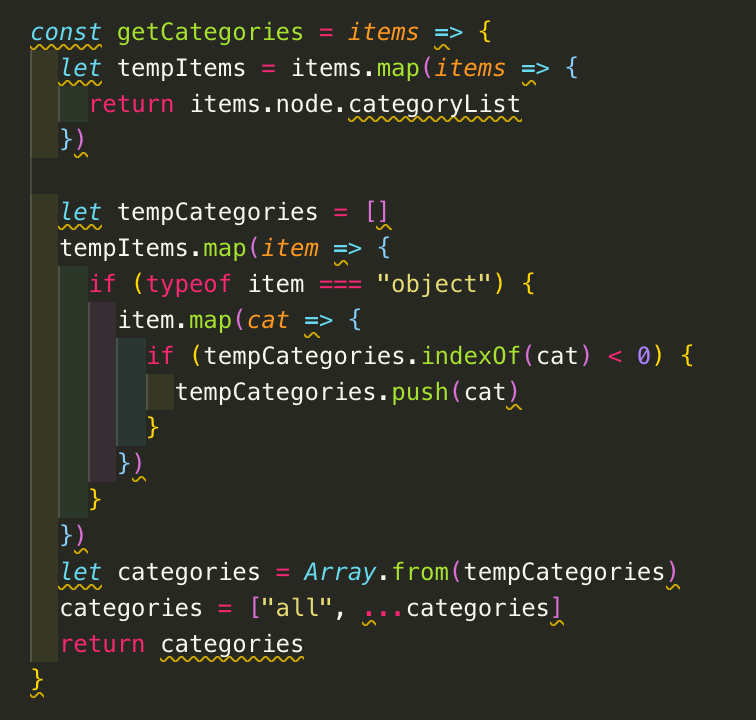

# Restaurant Website

### By Michael Claus

### https://mc-restaurant-site.netlify.com/

##### Built with

- ReactJS
- GatsbyJS
- GraphQL
- Contentful CMS
- Styled-Components
- Netlify

This is a repo for a fully responsive marketing website designed for a fake local eatery. It was built using React, Gatsby and Styled-Components. Gatsby JS is a static site generator, which renders static HTML from the React app. This means the website loads extremely fast. It uses Contentful as a CMS to store menu items, this way non-developer teams can add and edit menu items with ease. It deployed on Netlify and utilizes web hooks to rebuild the website any time the git repo or contentful data are updated.

### Code Snippets

##### Menu Item Filtering

These snippets of code display the logic for the filtering feature on the menu page.

First, we loop over every menu item. Each item is an object that contains a 'categories' array that has each singular category that that item falls into (ex. a Vegetarian Pizza is both a 'pizza' and 'vegetarian' so it should so up when one of these are selected). We then create a placeholder array and loop through each item and each items categories. If the temporary array does not contain a particular category, then we add it, otherwise we keep moving since we don't want duplicates. We now have a clean array of all of our categories, which we use to generate the filter buttons. We keep those code as DRY and functional as possible, so if we add or remove categories on Contentful, our code will have no problems.

Now that we have our category buttons, we set our state to the last button clicked. Our state category state starts as 'all' and renders all of our items regardless of their categories. As we click the differnt filtering buttons and modify our category state, we loop through all of our items and only render the items that contain the current category inside of their categories array.
